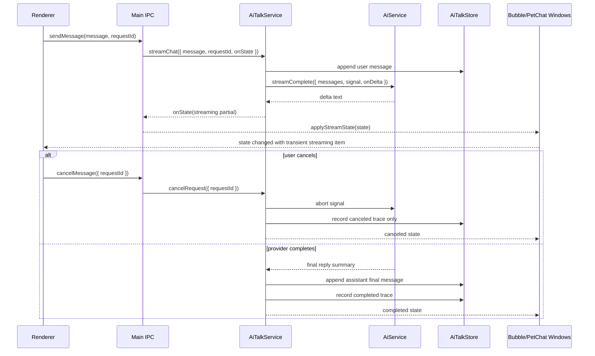

# AI Talk Streaming + Cancel 开发文档

> Date: 2026-07-09
> Scope: AI Talk 流式回复、取消生成、桌面聊天状态同步
> Baseline: `dev6` branch, based on local `main@b557fd4f`
> Status: Phase 1 core, Phase 2 IPC/window/renderer wiring, Phase 4 smoke/runbook closeout, and post-review streaming hardening are implemented on `dev6`; real-provider desktop feel remains Manual-required.

## 1. 文档定位

这份文档是 AI Talk Streaming + Cancel 的完整开发入口。它把当前代码结构、已落地能力、剩余开发边界、测试方式和验收口径收敛到一个位置，方便后续继续开发、review、合入和验收。

阅读顺序：

1. 先读本文档，确认当前真实状态、文件边界和验收步骤。
2. 需要理解产品与架构取舍时，读 design spec。
3. 需要继续实现未完成阶段时，按 implementation plan 的任务执行。
4. 需要合入前判断质量时，按本文档的测试矩阵和 review checklist 执行。

Related docs:

- Design spec: [`docs/superpowers/specs/2026-07-09-ai-talk-streaming-cancel-development-design.md`](./superpowers/specs/2026-07-09-ai-talk-streaming-cancel-development-design.md)
- Step-by-step implementation plan: [`docs/superpowers/plans/2026-07-09-ai-talk-streaming-cancel.md`](./superpowers/plans/2026-07-09-ai-talk-streaming-cancel.md)
- Current AI Talk architecture backlog: [`docs/openpet-current-todo-architecture.md`](./openpet-current-todo-architecture.md)
- Real provider Bubble Chat runbook: [`docs/superpowers/specs/2026-06-28-real-provider-chat-acceptance-runbook.md`](./superpowers/specs/2026-06-28-real-provider-chat-acceptance-runbook.md)

## 2. Product Goal

OpenPet 的 AI Talk 已经有一条主进程托管的聊天脑：`AiTalkService` 负责编译 persona、注入 memory、调用 provider、写入 transcript、触发宠物说话和行为决策。当前 milestone 的目标是在不引入第二套聊天脑的前提下，让同一条链路支持：

- AI 回复边生成边展示 partial reply。
- 用户可以从 Bubble Chat 或 PetChatWindow 取消当前生成。
- 取消或失败不会写入 assistant final transcript，不会触发 memory extraction，不会触发 behavior decision。
- Provider、AI Talk、IPC、窗口、renderer、smoke 都能通过同一个 `requestId` 串联诊断。
- Secret、完整 prompt、raw provider chunk、raw memory、完整用户输入不进入 renderer、普通插件或默认日志。

## 3. Milestone Contract

```text
Milestone：AI Talk Streaming + Cancel v1
目标：在现有 AI Talk 单脑架构上，为 Bubble Chat 与 PetChatWindow 接入同一条 streaming 生成和取消链路。
P0/P1 范围：Provider streaming adapter；AiTalk streaming lifecycle；trace/log redaction；IPC cancel contract；Bubble/PetChat transient streaming state；cancel recovery；smoke/runbook。
不做的 P2/P3：多会话 UI；向量记忆；历史摘要；AI Talk plugin extension；Markdown 富文本 streaming；多 provider 自动路由；成本面板。
Manual-required：真实 provider streaming 差异；长回复阅读体感；断网/限流/中途断流；桌面浮窗 placement 和 hit-testing 人工体验。
阶段上限：4
验收标准：非 streaming chat 不回归；支持 streaming 的 provider 产生 partial reply；Bubble Chat 与 PetChatWindow 显示同一 requestId；cancel 后进入 canceled 状态且不触发 side effects；trace/log 可诊断且无敏感数据；必要测试通过。
停止条件：P0/P1 完成并通过必要验证；阶段达到 4；真实 provider streaming 行为成为唯一剩余验收项。
```

## 4. Current Branch Progress

### Phase Status

| Phase | Scope | Current Status | Commit / State |
| --- | --- | --- | --- |
| Phase 1 | Provider streaming adapter | Implemented | `fccabdae feat(phase-1): add provider streaming adapter` |
| Phase 1 | AI Talk streaming lifecycle | Implemented | `e90b33be feat(phase-1): add ai talk streaming lifecycle` |
| Phase 2 | IPC stream/cancel contract | Implemented | `f78e56c2 feat(phase-2): add ai talk streaming ipc contract` |
| Phase 2 | Bubble Chat and PetChat renderer states | Implemented | `e3d0782b feat(phase-2): render ai talk streaming state` |
| Phase 3 | Cancel/failure recovery hardening | Covered by service/window/smoke tests | Needs real-provider manual confirmation |
| Phase 4 | Smoke/runbook/evidence closeout | Implemented | Current phase |

### Landed Or Implemented On `dev6`

- `AiService.streamComplete()` exists in `src/main/services/ai-service.js`.
- OpenAI-compatible SSE streaming deltas are parsed into normalized text deltas.
- Provider streaming supports abort signal and request timeout coordination.
- Provider timeout and user cancel are now separated: timeout surfaces as failed provider timeout, while user cancel remains canceled and side-effect-free.
- Streaming unsupported before any chunk falls back to existing `complete()`.
- Tool-enabled requests fall back to non-streaming for v1, preserving behavior tool support while still receiving the caller abort signal.
- `AiTalkService.streamChat()` exists in `src/main/services/ai-talk-service.js`.
- `AiTalkService.cancelRequest()` owns request cancellation through a main-process registry.
- User message is persisted at request start; assistant message is persisted only on final success.
- Canceled/failed streams do not schedule memory extraction or behavior decision.
- Streaming trace summaries are normalized/exported by `AiTalkStore`.
- Shared IPC constants exist for stream state and cancel channels.
- `src/main/ipc.js` can call `streamChat()` when available and fall back to existing chat when it is not.
- Bubble Chat and PetChatWindow services receive stream state through `applyStreamState?.()` if implemented.
- IPC tests cover shared cancel handlers and stream-state broadcast.
- `PetBubbleChatWindowManager.applyStreamState()` stores transient streaming state, drives visibility, and avoids durable partial persistence.
- `PetChatWindowManager.applyStreamState()` stores transient streaming state and `clearStreamState(requestId)` clears the completed transient item.
- Bubble Chat preload exposes `cancelMessage({ requestId })`.
- PetChat preload exposes `cancelMessage({ requestId })`.
- Bubble Chat renderer displays partial assistant text and a cancel button for cancellable states.
- Bubble Chat renderer rerenders partial updates for the same request/status by including chunk/partial counters in the transient item identity.
- PetChat renderer displays one transient assistant message with `data-request-id` and `data-status`.

### Post-review Hardening On `dev6`

Commit `00ea5bf9 fix(ai-talk): harden streaming cancel semantics` closes the production review findings from the first streaming implementation pass:

- Internal provider timeout no longer appears as user cancellation.
- Non-streaming fallback paths used for tools or unsupported streaming now receive the same abort signal.
- Bubble Chat partial text updates refresh even when `requestId` and status stay unchanged.
- Streaming delta accumulation preserves provider whitespace instead of trimming every chunk.
- Regression coverage was added for all four cases.

### Remaining Manual-required

- Real provider streaming/cancel evidence archive.
- Human desktop acceptance for long replies, cancel hit target, auto-hide behavior, and failure recovery copy.

### Current Real-provider Evidence

- Completed streaming archive: `docs/release-evidence/ai-talk-local-smoke/2026-07-09T00-03-49-088Z-streaming/`
  - `streamingAcceptance.completed = true`
  - `chunkCount = 34`
  - `firstDeltaLatencyMs = 1877`
  - `providerLatencyMs = 2259`
  - `bubbleDispatch.petSayReceived = true`
  - `bubbleDispatch.bubbleStateVisible = true`
- Canceled streaming archive: `docs/release-evidence/ai-talk-local-smoke/2026-07-09T00-04-20-568Z-streaming-cancel/`
  - `streamingAcceptance.canceled = true`
  - `completed = false`
  - `memoryExtractionScheduled = false`
  - `behaviorDecisionScheduled = false`
  - final bubble dispatch is intentionally skipped with `bubbleDispatch.reason = stream-canceled`
- Both archived reports passed redaction checks for API keys, Authorization/Bearer headers, raw smoke prompts, and local user-data paths in the persisted report.
- Follow-up provider smoke after the harness fix reports `connectionTest.ok = true`, `chat.ok = true`, and Bubble Chat dispatch success against the saved local provider configuration; the prior `network_error` was traced to the smoke file-backed SettingsService missing the production `update()` interface while model catalog persistence ran after a successful `/models` probe.
- Human desktop acceptance remains pending for visibility duration, hit target comfort, reading experience, and failure/cancel copy.

### Working Tree Note

Do not stage `tmp/`. Local smoke output belongs in temporary output directories unless explicitly archived through the release-evidence helper.

## 5. Architecture Boundaries

| Boundary | Files | Responsibilities | Must Not Do |
| --- | --- | --- | --- |
| Provider | `src/main/services/ai-service.js` | OpenAI-compatible HTTP, SSE parsing, timeout, abort, fallback, provider diagnostics | expose API key, raw chunk, raw prompt |
| AI Talk core | `src/main/services/ai-talk-service.js` | persona/history/memory/action context, request registry, stream lifecycle, transcript writes, side-effect gating | let renderer own AI logic, persist partial assistant text |
| Trace store | `src/main/services/ai-talk-store.js` | durable redacted trace summary and export filters | store raw prompt, raw memory, raw provider body |
| IPC | `src/main/ipc.js`, `src/shared/ipc-channels.*` | safe send/cancel handlers and stream-state fanout | create duplicate handlers, expose secrets |
| Bubble Chat window | `src/main/pet-bubble-chat-window.js` | lightweight transient streaming state, sending flag, visibility/auto-hide behavior | fork AI Talk transcript state |
| Bubble Chat renderer | `src/main/pet-bubble-chat/renderer.js`, preload | render partial assistant bubble, cancel current request | call provider directly |
| PetChat window | `src/main/pet-chat-window.js` | extended chat state with same transient stream request | create separate conversation brain |
| PetChat renderer | `src/main/pet-chat/renderer.js`, preload | render streaming assistant row, cancel current request | persist partial message as final |
| Smoke | `scripts/run-ai-talk-local-smoke.js` | opt-in provider streaming/cancel acceptance and sanitized report | write secrets, raw prompts, local private paths |

## 6. Runtime Data Flow



## 7. Stream State Contract

Renderer-visible state is intentionally narrow:

```ts
interface AiTalkStreamingViewState {
  requestId: string
  conversationId: string
  petPackId: string
  entrypoint: 'bubble-chat' | 'pet-chat' | 'control-center' | string
  status: 'started' | 'streaming' | 'completed' | 'canceled' | 'failed'
  partialReply: string
  partialReplyChars: number
  chunkCount: number
  canCancel: boolean
  errorMessage?: string
}
```

Rules:

- `partialReply` may be shown in renderer because it is model output.
- `partialReply` is transient until `completed`.
- `completed` state may display final reply immediately, but durable transcript comes from `AiTalkStore`.
- `canceled` and `failed` states never create an assistant transcript message.
- `canCancel` is only true for `started` and `streaming`.
- Status transitions are idempotent; repeated cancel and late chunks are safe.

## 8. Durable Trace Contract

Trace summaries record diagnosis, not content:

```ts
interface AiTalkStreamingTraceSummary {
  requestId: string
  conversationId: string
  petPackId: string
  streaming: boolean
  status: 'completed' | 'canceled' | 'failed'
  chunkCount: number
  partialReplyChars: number
  replyChars: number
  elapsedMs: number
  providerLatencyMs: number
  finishReason?: string
  cancelReason?: string
  errorCode?: string
  memoryExtractionScheduled: boolean
  behaviorDecisionScheduled: boolean
}
```

Forbidden in trace/log/export:

- API key or Authorization header.
- Full prompt or compiled system prompt.
- Raw provider SSE event/chunk.
- Full user message.
- Raw memory text or raw memory evidence.
- Raw provider response body.

## 9. Provider Behavior

`AiService.streamComplete()` must keep these semantics:

- Sends OpenAI-compatible `/chat/completions` with `stream: true`.
- Calls `onDelta(text)` only with provider text deltas; deltas must preserve provider whitespace.
- Returns `{ reply, streaming, fallback, fallbackReason, chunkCount, finishReason, elapsedMs }`.
- If tools are present, uses non-streaming fallback with `fallbackReason: 'tools-not-supported'`.
- If provider returns unsupported-stream style failure before any chunk, falls back to non-streaming completion.
- If chunks have already started and stream fails, does not transparently fallback, because fallback could duplicate or contradict visible partial output.
- Abort errors bubble to AI Talk as cancellation when the request registry says cancellation was requested.
- Timeout errors bubble to AI Talk as failed provider timeout, not cancellation.

## 10. AI Talk Lifecycle

### Started

- Resolve active pet-pack.
- Compile persona: pet-pack default plus local override.
- Build memory context and recent pet activity context.
- Append user message unless `skipUserAppend` is used by the caller.
- Register request with `AbortController`.
- Emit `started` stream state.
- Record `ai-talk.stream.started`.

### Streaming

- Accumulate normalized deltas into `partialReply`.
- Emit transient `streaming` state.
- Record chunk count and partial character count.
- Keep callbacks isolated; renderer/window broadcast failure must not abort provider completion.

### Completed

- Append final assistant reply to durable transcript.
- Create bubble segments.
- Mark injected memories as used.
- Schedule memory extraction if enabled.
- Preserve behavior intent path only after final reply.
- Emit `completed`.
- Record completed trace summary.

### Canceled

- Abort provider request through the registry.
- Keep user message in transcript.
- Do not append assistant message.
- Do not schedule memory extraction.
- Do not schedule behavior decision.
- Emit `canceled`.
- Record canceled trace summary.

### Failed

- Keep user message in transcript.
- Do not append assistant message.
- Do not schedule side effects.
- Emit `failed` with sanitized `errorMessage`.
- Record failed trace summary.

## 11. IPC Channels

Shared channels currently defined in `src/shared/ipc-channels.js` and `src/shared/ipc-channels.ts`:

```ts
PET_BUBBLE_CHAT_CANCEL_MESSAGE = 'pet-bubble-chat:cancel-message'
PET_CHAT_CANCEL_MESSAGE = 'pet-chat:cancel-message'
```

Current `src/main/ipc.js` behavior:

- Bubble Chat send path uses `aiTalkService.streamChat()` when available.
- PetChat send path uses `aiTalkService.streamChat()` when available.
- Both paths fall back to legacy non-streaming chat path if streaming service is absent.
- `onState` fanout calls `petBubbleChatWindowService.applyStreamState?.(state)` and `petChatWindowService.applyStreamState?.(state)`.
- Cancel handlers call `aiTalkService.cancelRequest()` with `sourceSurface`.

Renderer-facing preload APIs now exist for Bubble Chat and PetChatWindow. They only pass `requestId` back to main process cancel handlers and do not expose provider config, prompts, or secrets.

## 12. UI Development Requirements

### Bubble Chat

`applyStreamState(state)` in `src/main/pet-bubble-chat-window.js` must keep these invariants:

- Normalize the state.
- Store it as `state.streaming`.
- Set `sending = true` for `started` and `streaming`.
- Set `sending = false` for terminal states.
- Broadcast state using the existing Bubble Chat state change path.
- Keep the window visible during `started`, `streaming`, `canceled`, and `failed`.
- Do not insert partial text into durable dialogue history.
- Clear matching transient state when `completeRequest()` or `failRequest()` refreshes durable dialogue.

Renderer behavior in `src/main/pet-bubble-chat/renderer.js`:

- Render transient assistant bubble after existing dialogue items.
- Show partial text while streaming.
- Show a cancel button only when `canCancel === true`.
- Clicking cancel calls `window.petBubbleChatAPI.cancelMessage({ requestId })`.
- Terminal canceled/failed state should be visually clear and allow the user to type again.
- The transient streaming item must be derived only from `state.streaming`; durable dialogue `items` remain the source for completed transcript display.

### PetChatWindow

`applyStreamState(state)` in `src/main/pet-chat-window.js` must keep these invariants:

- Store `state.streaming` in the window state returned by `getState()`.
- Broadcast through existing `PET_CHAT_STATE_CHANGED`.
- Keep transcript messages and transient streaming message separate.
- Clear matching completed transient state before returning final `PET_CHAT_SEND_MESSAGE` state, otherwise the final assistant reply can appear twice.

Renderer behavior in `src/main/pet-chat/renderer.js`:

- Render one transient assistant item after durable messages.
- Mark it with `data-status="streaming"`, `data-status="canceled"`, or `data-status="failed"`.
- Show cancel button only while cancellable.
- Remove or disable cancel affordance on terminal states.
- Do not create local synthetic assistant history from partial text.

## 13. Smoke And Evidence Requirements

`scripts/run-ai-talk-local-smoke.js` supports explicit streaming and cancel options:

```bash
npm run run-ai-talk-local-smoke -- \
  --message "请用三句话慢慢回复，用于 streaming 验收" \
  --stream \
  --output-dir ai-talk-streaming-smoke
```

Cancel smoke:

```bash
npm run run-ai-talk-local-smoke -- \
  --message "请生成一段较长回复，用于 cancel 验收" \
  --stream \
  --cancel-after-ms 500 \
  --output-dir ai-talk-streaming-cancel-smoke
```

Sanitized report fields:

```json
{
  "streamingAcceptance": {
    "requestId": "chat-...",
    "chunkCount": 12,
    "firstDeltaLatencyMs": 420,
    "providerLatencyMs": 2340,
    "completed": true,
    "canceled": false,
    "memoryExtractionScheduled": true,
    "behaviorDecisionScheduled": false
  }
}
```

Smoke claims must stay narrow:

- It can prove service chain, provider completion, request correlation, and sanitized reporting.
- It cannot by itself prove desktop placement, dwell time, reading comfort, or hit-testing quality.
- It must not archive API keys, raw prompts, raw provider chunks, or full memory text.

## 14. Developer Workflow

Before editing:

```bash
git branch --show-current
git status --short
git worktree list
```

Rules:

- Work on `dev6` or another feature worktree, not the protected primary `main` worktree.
- Rebase feature branch onto latest `main` before merging.
- Stage only files that belong to the current phase.
- Keep `tmp/`, `node_modules/`, `dist/`, release artifacts, and generated local smoke output out of commits unless the phase explicitly archives evidence.
- Use TDD for code changes: add focused failing tests, run them, implement minimal code, rerun tests.
- End each phase with `production-code-quality-review` and fix P0/P1 blockers before commit.

## 15. Test Matrix

### Phase 1/2 Core Regression

```bash
node --test tests/services/ai-service.test.js
node --test tests/services/ai-talk-service.test.js tests/services/ai-talk-store.test.js
node --test tests/main/pet-chat-ipc.test.js
npm run check:syntax
```

### Renderer And Window Regression

```bash
node --test tests/main/pet-bubble-chat-window.test.js \
  tests/main/pet-bubble-chat-renderer.test.js \
  tests/main/pet-chat-renderer.test.js \
  tests/main/pet-chat-window.test.js
```

### Focused Full AI Talk Streaming Regression

```bash
node --test tests/services/ai-service.test.js \
  tests/services/ai-talk-service.test.js \
  tests/services/ai-talk-store.test.js

node --test tests/main/pet-chat-ipc.test.js \
  tests/main/pet-bubble-chat-window.test.js \
  tests/main/pet-bubble-chat-renderer.test.js \
  tests/main/pet-chat-renderer.test.js \
  tests/main/pet-chat-window.test.js

node --test tests/scripts/run-ai-talk-local-smoke.test.js
npm run test:core
npm run check:syntax
```

Current known verification from Phase 2 working tree:

- `node --test tests/main/pet-bubble-chat-window.test.js tests/main/pet-chat-window.test.js tests/main/pet-bubble-chat-renderer.test.js tests/main/pet-chat-renderer.test.js tests/main/pet-chat-ipc.test.js` passed with 81 tests.
- `node --test tests/services/ai-service.test.js tests/services/ai-talk-service.test.js tests/services/ai-talk-store.test.js` passed with 96 tests.
- `npm run check:syntax` passed.
- `npm run test:core` passed with 1172 tests.
- Existing `MODULE_TYPELESS_PACKAGE_JSON` warnings are pre-existing and non-blocking.

Current known verification after post-review hardening:

- `node --test tests/services/ai-service.test.js tests/services/ai-talk-service.test.js tests/services/ai-talk-store.test.js tests/main/pet-chat-ipc.test.js tests/main/pet-bubble-chat-window.test.js tests/main/pet-bubble-chat-renderer.test.js tests/main/pet-chat-renderer.test.js tests/main/pet-chat-window.test.js tests/scripts/run-ai-talk-local-smoke.test.js` passed with 191 tests.
- `npm run test:core` passed with 1177 tests.
- `npm run check:syntax` passed, including Node syntax check, TypeScript `tsc --noEmit`, and Control Center Vite build.
- `git diff --check` passed.

## 16. Production Review Checklist

Use `production-code-quality-review` at the end of each phase.

Review report must include:

```text
严重问题：
中等问题：
非阻塞建议：
安全风险：
稳定性风险：
可维护性风险：
测试覆盖：
质量评分：
通过状态：
```

Blockers that must be fixed before merge:

- Any API key, Authorization header, raw prompt, raw memory, raw chunk, or full user text in renderer/log/export.
- Assistant partial text persisted as a final transcript message.
- Cancel still triggering memory extraction or behavior decision.
- Duplicate IPC handler registration.
- `npm start` startup failure.
- Non-streaming chat regression.
- UI surfaces displaying different request lifecycle for the same `requestId`.

## 17. User Acceptance Steps

After the Phase 2 renderer/window commit lands:

1. Start the configured local provider gateway at `http://127.0.0.1:8317/v1`.
2. Confirm Control Center AI chat provider uses the saved gateway config and model `gpt-5.5`.
3. Run `npm start`.
4. Open Bubble Chat from the pet and send a long prompt.
5. Confirm partial reply appears before final completion.
6. Click cancel during a long reply.
7. Confirm UI enters canceled state and the next message can be sent.
8. Open PetChatWindow and repeat the same flow.
9. Inspect `~/Library/Application Support/ibot/logs/openpet-app.jsonl`.
10. Confirm logs have `ai-talk.stream.started`, `ai-talk.stream.delta`, and terminal `completed` or `canceled` events.
11. Confirm logs do not contain API key, raw prompt, or raw provider chunks.
12. Repeat once with the PetChatWindow open and once with only Bubble Chat open.
13. If cancel appears to do nothing, capture the `requestId` shown in renderer state/logs and search `openpet-app.jsonl` for that id.

## 18. Phase 4 Exit Criteria

Phase 4 can close the milestone when all of these are true:

- `scripts/run-ai-talk-local-smoke.js` accepts `--stream` and `--cancel-after-ms`.
- Smoke tests cover completed streaming and canceled streaming report shape.
- Report includes request correlation, chunk count, first delta latency, provider latency, terminal status, and side-effect flags.
- Report redaction tests prove secrets, raw prompts, raw chunks, and raw memory are absent.
- Manual runbook explains local provider setup, Bubble Chat acceptance, PetChatWindow acceptance, log inspection, and known claim boundaries.
- `npm run test:core`, `npm run check:syntax`, and focused smoke tests pass.
- Production review passes or only leaves non-blocking P2/P3 backlog.

## 19. Backlog After V1

- Streaming with behavior tool calls instead of v1 fallback.
- Markdown/rich content rendering.
- Multiple conversations per pet-pack.
- Long-history summarization.
- Embedding/vector memory retrieval.
- Manual memory approval/privacy controls.
- Plugin extension points for AI Talk.
- Provider routing/failover.
- Real-time token/cost display.
